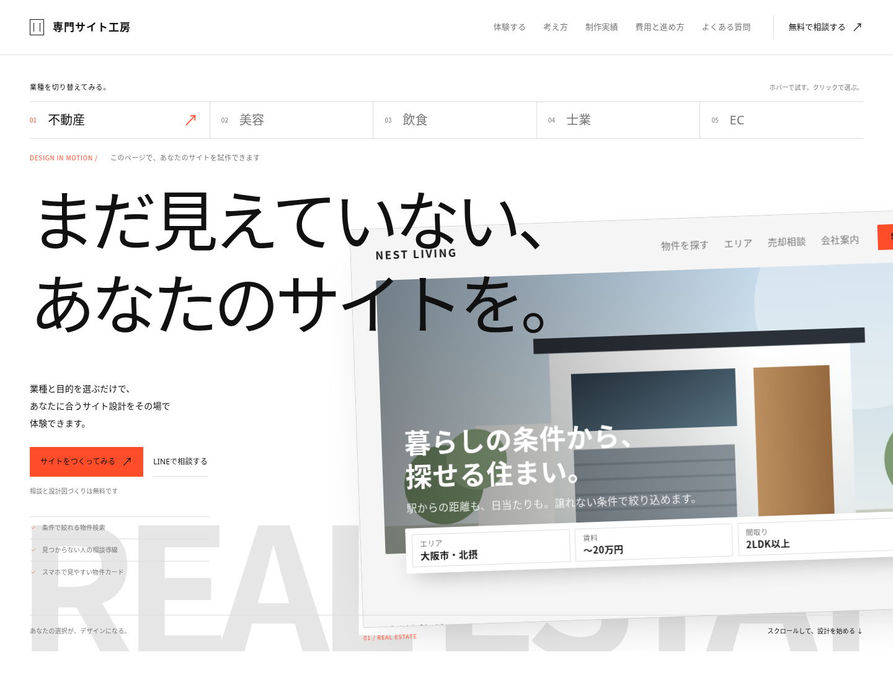
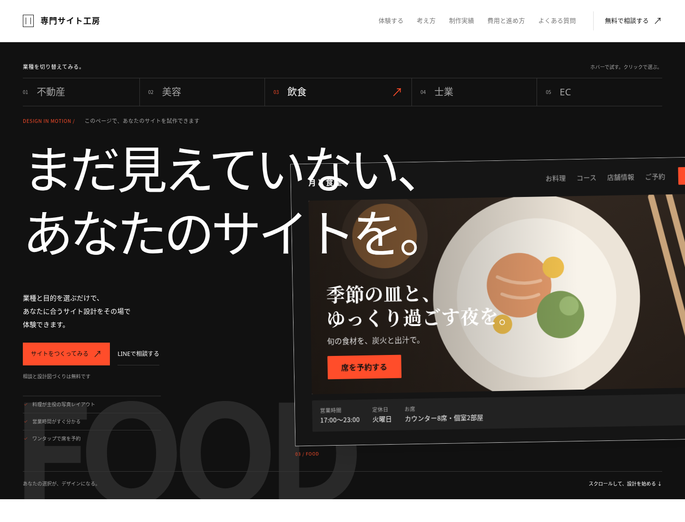
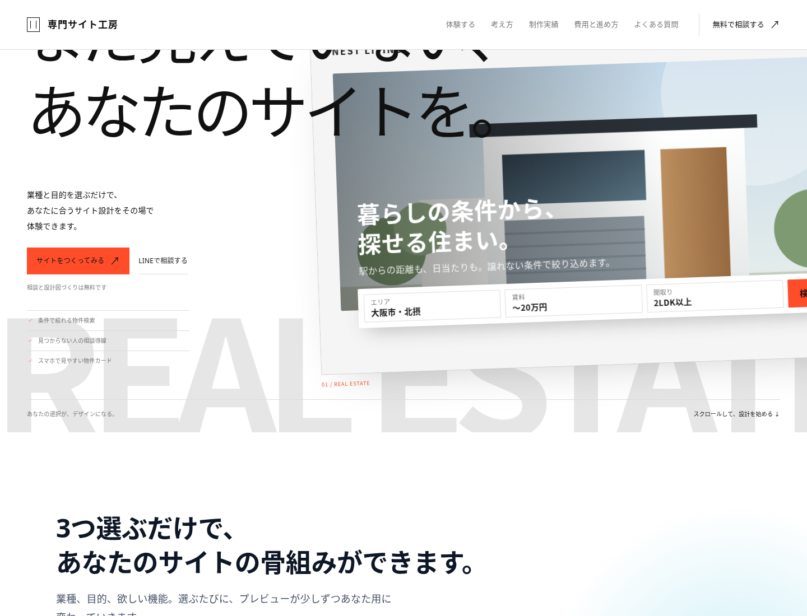
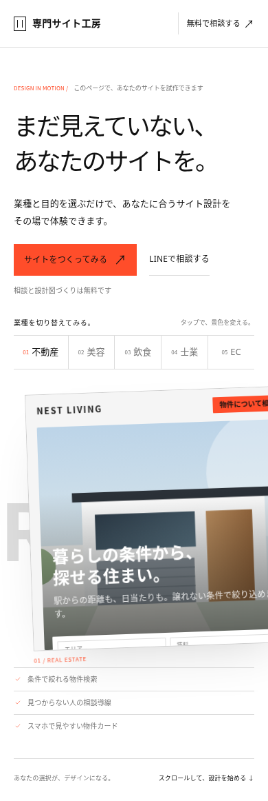
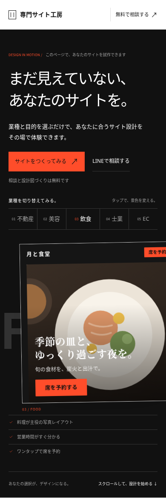

# Editorial × digital product — デザイン確認

ファーストビューと業種選択体験を再設計しました。以下は実装をブラウザで撮影した画像です。

- PC：業種にホバーすると仮のプレビューに切り替わり、クリックで選択が確定します。離れると元の選択に戻ります。
- スマホ：業種をタップすると、背景・大きな業種名・プレビューの構図が切り替わります。
- スクロールするとプレビューの幅と位置が変わります。「動きを減らす」設定では移動・傾きを抑えます。
- 選択した業種は既存のサイト制作体験に引き継がれます。

操作する場合は、[変更版ZIPをダウンロード](https://github.com/eyueyu0806-sys/website-studio/archive/refs/heads/design/editorial-first-view-20261004.zip)して展開し、ルートの `index.html` をブラウザで開いてください。

## PC — 初期表示（1440px）

## PC — 飲食を選択

## PC — スクロール後

## スマホ — 初期表示（390px）

## スマホ — 飲食を選択

320・390・768・1024・1440px幅で、選択・キーボード操作・スクロール・生成・屋号変更・相談フォームへの構成添付を検証済みです。JavaScript例外はありません。その他のセクション、生成ロジック、フォーム処理は維持しています。
