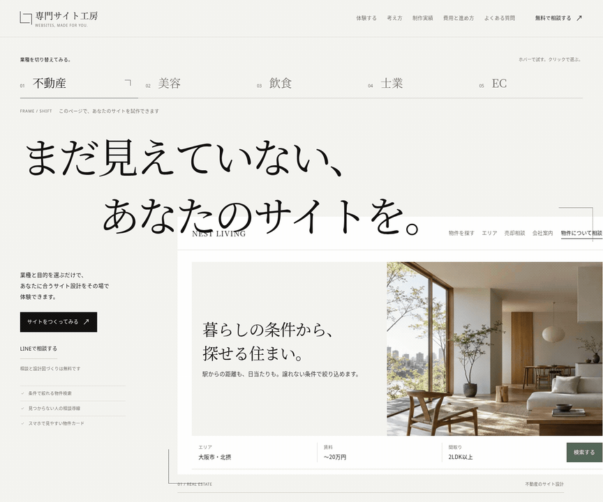
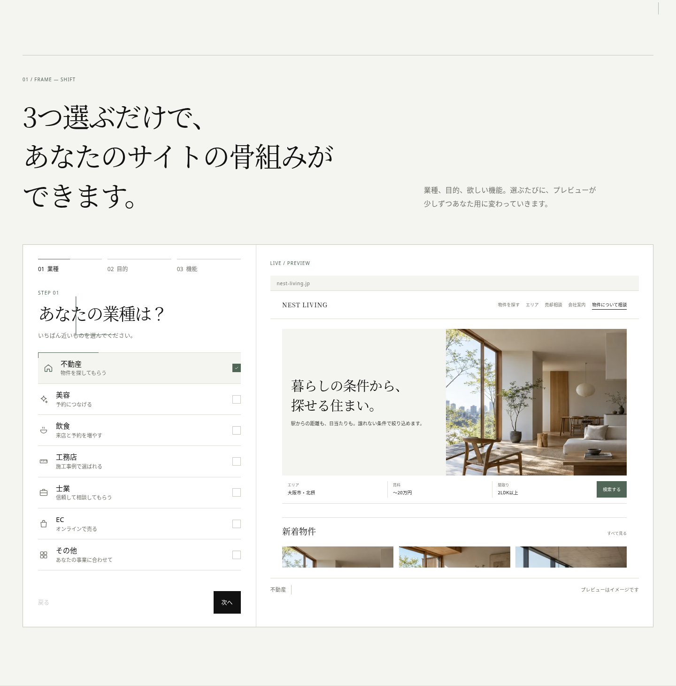
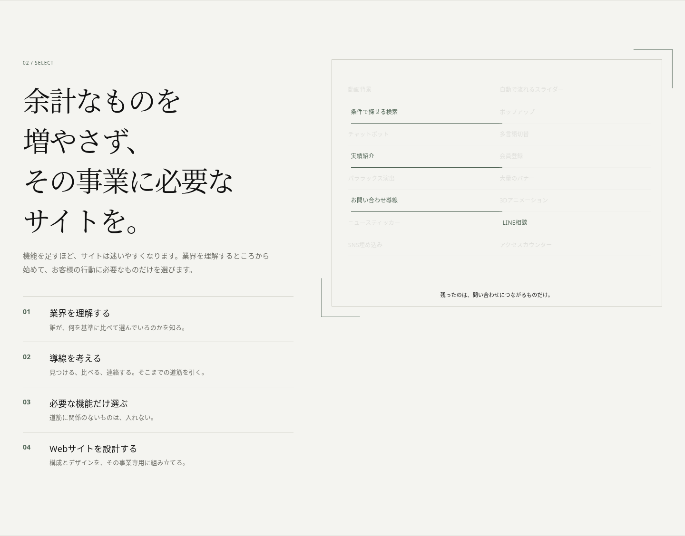

# FRAME / SHIFT

「まだ見えていないサイトに、輪郭を与える。」

ヘッダーの2つのL字を、サイト全体の操作と構図へ広げたレビュー版です。Hero、業種選択、ライブプレビュー、Builder、Philosophy以降まで、同じ色・日本語組版・罫線・クロップで統合しています。

## 動きから見る

実際のブラウザの録画です。業種によってプレビューとフレームの位置・幅・比率が変わり、スクロールするとフレームがBuilderの作業面へ移ります。



## 今回の変更

- 白、`#F4F4F0`、`#111111`、`#6F6F68`と、アクセントの`#526657`へ統一。日本語の明朝体を見出し、クリーンなゴシック体を操作・本文に使っています。
- 巨大な英単語、ambient glow、ガラス風パネル、AI的グラデーション、pill、強い影、過剰な角丸を撤去。
- 業種選択はプレビューとフレームを一体で変えるトリガーへ。ホバーで試し、クリック・タップ・キーボードで確定します。
- Builderは選択項目とプレビューを同じ一枚のcanvasへ。選択状態とホバーは罫線・開いた角・小さな位置変化で伝えます。
- ライブプレビューは日本語の組版と写真で架空のWebサイトを表現。業種変更は内容を即時更新して滑らかに切り替えます。
- 屋号はHero、Builder、PC・スマホのプレビュー、相談内容に引き継がれます。
- スクロールのフレームは各セクションの実際の位置・サイズを追います。OSの「動きを減らす」設定ではスナップ表示へ切り替わります。

文章、セクション順、業種・目的・機能の3ステップ、推薦ルール、生成結果、フォーム連携は維持しています。新しい写真は架空サイトのデモ用素材です。実案件の写真・実績としては使用していません。[素材の説明](../assets/images/README.md)

## 表示確認

| 幅 | Hero | Builder | 生成結果 |
| --- | --- | --- | --- |
| Desktop 1440px | [画像](desktop.png) | [全体](frame-builder-1440.png) / [実際の画面](frame-builder-1440-viewport.png) | [画像](frame-result-1440.png) |
| Desktop 1200px | [画像](frame-hero-1200.png) | [全体](frame-builder-1200.png) / [実際の画面](frame-builder-1200-viewport.png) | [画像](frame-result-1200.png) |
| Mobile 390px | [画像](mobile.png) | [全体](frame-builder-390.png) / [実際の画面](frame-builder-390-viewport.png) | [画像](frame-result-390.png) |

長いセクションの全体画像では、固定ヘッダーだけを非表示にして途中への重複写り込みを避けています。「実際の画面」は固定ヘッダーを含むそのままの表示です。

### Hero / Desktop


### Builder / Desktop



### Hero / Mobile


### Philosophy以降の統一



[制作実績](frame-works-1440.png) · [費用・進め方](frame-price-1440.png) · [FAQ](frame-faq-1440.png) · [相談フォーム](frame-contact-1440.png) · [スマホのPhilosophy](frame-think-390.png) · [スマホの相談フォーム](frame-contact-390.png)

### 別業種と屋号の反映

[飲食・Desktop](desktop-food.png) · [飲食・Mobile](mobile-food.png) · [屋号・Desktop](desktop-personalized.png) · [屋号・Mobile](mobile-personalized.png)

## 実際に触る

[レビュー版をZIPでダウンロード](https://github.com/eyueyu0806-sys/website-studio/archive/refs/heads/design/editorial-first-view-20261004.zip)

展開したフォルダーで`index.html`と`assets/`を同じ場所に保ち、HTTPサーバーから開いてください。検証に使ったローカル起動手順は次の通りです。

```sh
python3 -m http.server 8000
```

起動したPCのブラウザで`http://127.0.0.1:8000/`を開きます。ビルド・npmインストール・APIキーは不要です。画像と日本語displayフォントは同梱しています。フォントのライセンスは[OFL.txt](../assets/fonts/OFL.txt)に記載しています。

## 検証結果

- 1440px、1200px、390pxで横方向のはみ出し、デスクトップの2列canvas、スマホの縦方向の操作面とプレビューを確認。
- 539通りの業種・目的・機能で、変更前と生成ページ、問い合わせ導線、推薦機能、理由、プレビューのモジュール順・文章が一致。
- 全業種、ホバーと選択の分離、タップ、キーボード、機能追加・解除、屋号の同期とエスケープ、生成、相談添付・解除、入力検証、FAQ、全ページのスクロールを確認。
- 動きを減らす設定とダークモードのOS設定でも確認。外部Google Fontsを遮断しても、同梱displayフォントと本文のフォールバックで表示・操作が成立。
- ローカルHTTP環境でJavaScript例外・ローカル素材の取得エラーなし。

この環境の管理ポリシーで`file://`の直接表示は検証対象外です。HTTP経由の表示・操作を検証しています。
