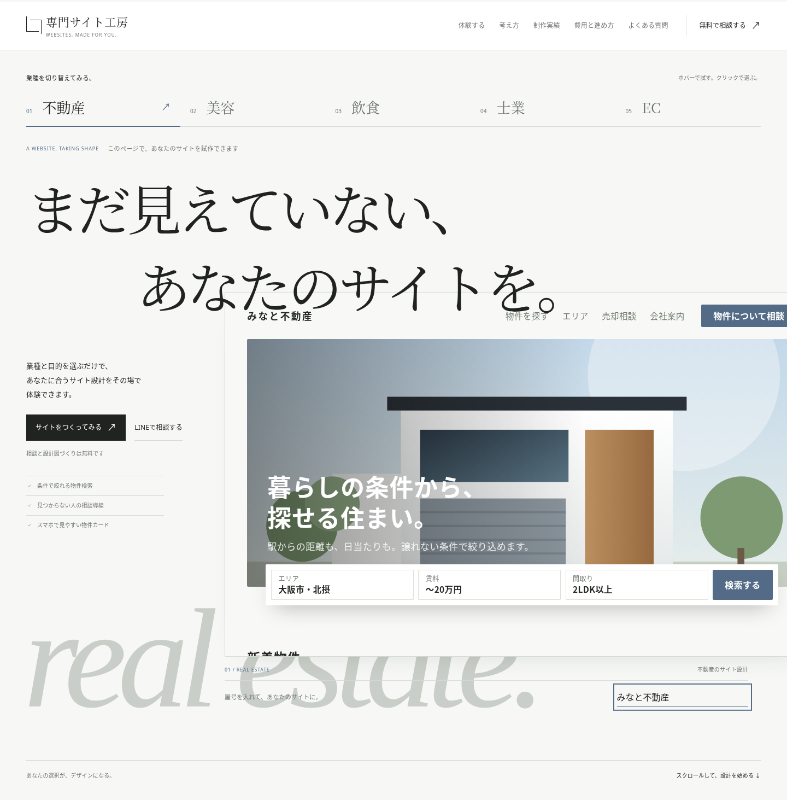
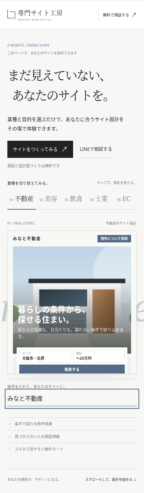
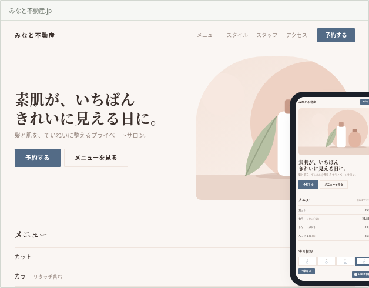

# Working proof — a website taking shape

This iteration refines the header, hero, industry selector and live preview. A Japanese serif display face, staggered headline, italic industry lettering and clean UI type give the studio a consistent editorial identity. Neutral paper tones and a muted ink-blue accent replace the bright orange treatment.

The interaction uses the actual website preview:

- Hover an industry to try its design; click to select it. Moving away restores the selected industry. On touch devices, tap to select.
- Industry changes update the page immediately and blend between the two designs. The hero and builder previews have no generation overlay, glow or spinner.
- Enter a business name below the preview to see it appear in the hero, builder and completed website. The name also carries into the consultation summary.
- Scrolling gently changes the preview's width and position. Reduced-motion settings remove these movements and the preview crossfade.

Both original Japanese copy lines, the rule-based generator, builder steps and contact logic are preserved. Other sections retain their previous layout and styles.

## Try the full bundle

[Download the review branch ZIP](https://github.com/eyueyu0806-sys/website-studio/archive/refs/heads/design/editorial-first-view-20261004.zip), extract it, and keep the `assets` folder beside `index.html`.

For the verified local workflow, run the following from the extracted repository folder:

```sh
python3 -m http.server 8000
```

Then open `http://127.0.0.1:8000` in your browser. No package installation or API credentials are needed. The display font is bundled locally; its attribution and SIL OFL license are in `assets/fonts/OFL.txt`.

## Desktop — the studio composition


## Desktop — your business name in the proof



## Mobile — your business name in the proof



## Industry transformation — food


## The live preview in the existing builder



## Validation

Browser checks passed at 320, 390, 768, 1024 and 1440px: font loading, responsive layout, hover and touch selection, keyboard navigation, rapid switching, reduced motion, business-name synchronization and escaping, generation, and consultation attachment. No JavaScript exceptions occurred. Unrelated section styles match the baseline.

Checks used a local HTTP server with external font requests blocked. Direct `file://` navigation could not be tested because the managed browser blocks it; the HTTP workflow above was verified.
